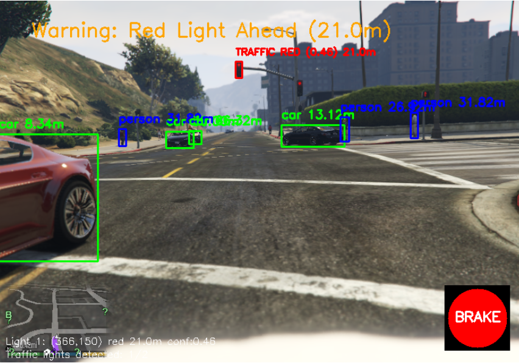
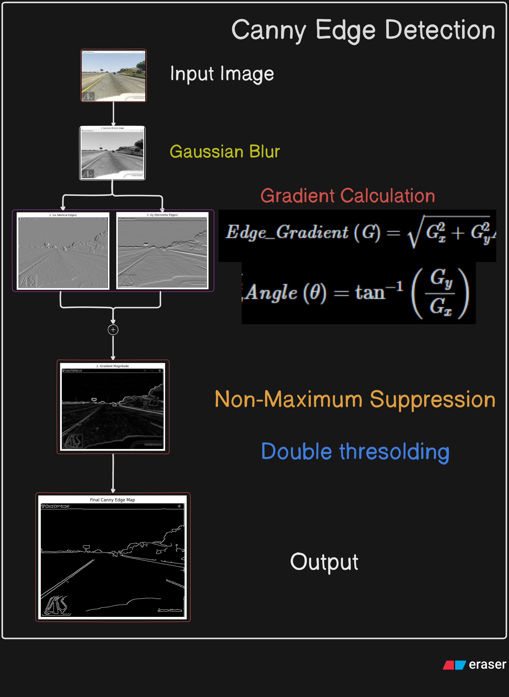
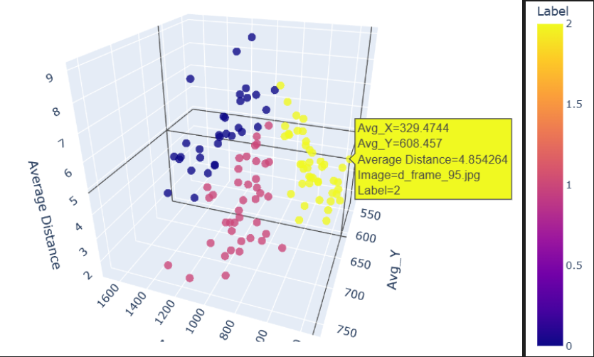

# ADAS: Advanced Driver Assistance System Simulation

An intelligent virtual driver assistance system developed and tested within the Grand Theft Auto V environment, combining real-time computer vision, machine learning, and automated decision-making for autonomous driving simulation.

---

LINK : [Watch Demo Video](https://drive.google.com/file/d/1bEXkHN2zhW2vHzMJ8hJZaaMw-VHuNA2O/view?usp=sharing)

---

*Real-time object detection using YOLOv8*

---
*Lane detection using Canny Edge Detection and Hough Line Transform*

---
*Action prediction system model visual representation*

## 🎯 Project Objectives

This Advanced Driver Assistance System demonstrates autonomous driving capabilities through:

- **Real-time Object Recognition**: Detecting vehicles, pedestrians, and obstacles
- **Intelligent Lane Detection**: Identifying and following road markings
- **Automated Decision Making**: Predicting optimal driving actions
- **Dynamic Vehicle Control**: Real-time steering and braking in virtual environment

## 🔧 Core Technologies & Architecture

### Computer Vision Pipeline
- **YOLOv8**: State-of-the-art object detection for vehicles and pedestrians with 90%+ accuracy
- **OpenCV**: Advanced image processing and computer vision operations
- **MSS**: High-performance screen capture for real-time video feed
- **Canny Edge Detection**: Precise edge filtering for lane boundary identification

### Machine Learning Components
- **Support Vector Machine (SVM)**: RBF kernel-based action classification achieving 100% accuracy
- **Custom Training Dataset**: Labeled driving scenarios with positional features (`Avg_X`, `Avg_Y`, `Avg_Distance`)
- **Action Categories**: Left turn (`0-a`), Brake (`1-s`), Right turn (`2-d`)

### Lane Detection System
- **Region of Interest Masking**: Focuses processing on relevant road areas
- **Hough Line Transform**: Detects lane markings with high precision
- **Heuristic Auto-Steering**: Dynamic steering based on lane line orientation
- **Continuous Processing Loop**: Real-time lane updates through image capture

### Navigation Intelligence
- **Mini-map Integration**: Detects in-game purple navigation paths
- **Destination Routing**: Automated pathfinding to reach specified locations

## 🚀 System Performance

| Component | Performance Metric |
|-----------|-------------------|
| **Object Detection** | 90%+ accuracy in vehicle/pedestrian detection |
| **Action Prediction** | 100% accuracy on custom dataset |
| **Lane Detection** | Reliable performance in standard conditions |
| **Response Time** | Minimal latency for real-time keypress simulation |

## 📊 Dataset & Training Details

**Custom Dataset Features:**
- `Avg_X`: Average X-coordinate of detected objects
- `Avg_Y`: Average Y-coordinate of detected objects  
- `Avg_Distance`: Calculated distance based on bounding box analysis

**Training Methodology:**
- SVM with RBF kernel for optimal classification performance
- Real-world driving scenario simulation
- Comprehensive action labeling system

## 🛠️ Technical Implementation

| Technology | Application |
|------------|-------------|
| **Python** | Core programming language |
| **YOLOv8** | Real-time object detection |
| **OpenCV** | Image processing and computer vision |
| **SVM (RBF)** | Machine learning classification |
| **MSS** | Screen capture technology |
| **Keyboard Module** | Automated driving input simulation |

## 📈 Results & Validation

### Object Detection Performance
- Successfully identifies vehicles, trucks, and pedestrians in real-time
- Distance estimation using bounding box dimensions and camera calibration
- Robust performance across various lighting and weather conditions

### Action Prediction Accuracy
- Perfect classification on training dataset
- Real-time decision making with minimal computational overhead
- Seamless integration with vehicle control systems

### Lane Detection Capabilities
- Effective lane tracking in standard driving conditions
- Challenges identified in poor lighting and complex intersections
- Continuous improvement through heuristic refinement

## 🔮 Future Enhancements

**Recommended Improvements:**
- **Deep Learning Lane Segmentation**: Advanced neural networks for improved lane detection
- **Model Optimization**: Faster inference times for enhanced real-time performance
- **Environmental Adaptation**: Better handling of diverse weather and lighting conditions
- **Multi-object Tracking**: Enhanced object persistence across frames

## 📁 Project Resources

### Documentation
- **Detailed Presentation**: [Google Drive - Project PPT](https://docs.google.com/presentation/d/1PXoY5QOw2I_QVaKsxp7SVMUBJpFGDEQV/edit?usp=drive_link&ouid=117557035913447964554&rtpof=true&sd=true)
- **Technical Report**: [Google Drive - Project Report](https://drive.google.com/file/d/1u9rLjcvdCavckyyc1t1DMZ9EUl_kNGGK/view?usp=drive_link)

## 💡 Conclusion

The ADAS project successfully demonstrates the feasibility of virtual driver assistance systems using computer vision and machine learning within simulated environments. While achieving excellent performance in controlled conditions, the system provides a solid foundation for advancing autonomous driving research and development.

**Key Achievements:**
- Integrated multi-modal AI system for autonomous driving
- High-accuracy object detection and action prediction
- Real-time performance in virtual environment
- Comprehensive documentation and testing

This project showcases the potential of combining traditional computer vision techniques with modern machine learning approaches for creating intelligent transportation systems.
